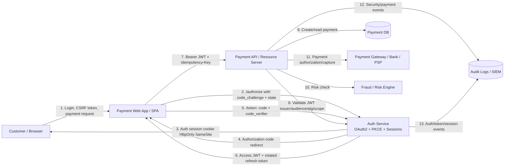

# Data-flow diagram: payment flow with secure auth

## Context

This DFD models a browser-based payment web app that uses OAuth2 Authorization Code + PKCE, an authorization server, a payment API, a payment service/provider, and a database.

## Trust boundaries

1. Browser boundary: untrusted user device, JS runtime, extensions, cached data.
2. Internet boundary: TLS required between browser, frontend, auth service, and APIs.
3. Auth boundary: token issuance, session creation, PKCE validation, JWT signing.
4. Payment API boundary: JWT validation, scope check, object-level authorization, idempotency.
5. Third-party PSP boundary: external gateway/bank APIs and webhook callbacks.
6. Data boundary: payment DB and logs containing sensitive security/payment metadata.

## High-value assets

- Authorization code
- PKCE code verifier
- Session cookie
- Access token JWT
- Refresh token
- Payment amount, currency, status, beneficiary/merchant data
- Idempotency key
- PSP transaction reference
- Audit logs
